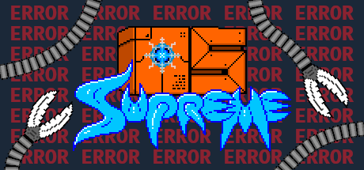

### Hi there 👋

I tinker with C++ and occassionaly make custom plugins for the Godot Engine.

Currently, I'm working a cool & brand spanking new operating system made in the Godot Engine!  
You can check it out here:

  

<!--
**2shady4u/2shady4u** is a ✨ _special_ ✨ repository because its `README.md` (this file) appears on your GitHub profile.

Here are some ideas to get you started:

- 🔭 I’m currently working on ...
- 🌱 I’m currently learning ...
- 👯 I’m looking to collaborate on ...
- 🤔 I’m looking for help with ...
- 💬 Ask me about ...
- 📫 How to reach me: ...
- 😄 Pronouns: ...
- ⚡ Fun fact: ...
-->
